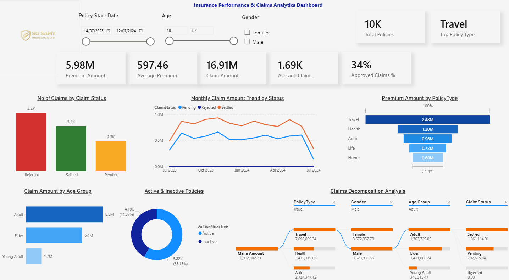

# Insurance Performance & Claims Analytics Dashboard

## Project Overview

This interactive Power BI dashboard provides an executive-level overview of insurance policy performance, claims analytics, customer activity, and operational KPIs.

The dashboard focuses on premium analysis, claim trends, policy performance, customer segmentation, claim approval monitoring, and operational insights to support data-driven business decision-making.

---

## Features

- Premium & Claims Analysis
- Claim Ratio KPI Monitoring
- Active vs Inactive Policy Analysis
- Policy Type Performance Tracking
- Claims Status Analysis
- Customer Demographic Insights
- Monthly Claims Trend Analysis
- Claims Decomposition Analysis
- Interactive Slicers & Filters
- DAX Measures & KPI Calculations

---

## Technologies Used

- Power BI Desktop
- DAX
- Power Query
- Excel
- Insurance KPI Analytics

---

## Dashboard KPIs

- Total Premium Amount
- Average Premium
- Claim Amount
- Average Claim Amount
- Approved Claims %
- Claim Ratio %
- Total Policies

---

## Sample DAX Measures

### Claim Ratio %

```DAX
Claim Ratio % =
DIVIDE(
    [Claim Amount],
    [Premium Amount]
)
```

### Approved Claims %

```DAX
Approved Claims % =
DIVIDE(
    CALCULATE(
        COUNT(InsuranceData[ClaimStatus]),
        InsuranceData[ClaimStatus] = "Approved"
    ),
    COUNT(InsuranceData[ClaimStatus])
)
```

### Claim Amount

```DAX
Claim Amount =
SUM(InsuranceData[ClaimAmount])
```

---

## Dashboard Preview



---

## Repository Structure

- dataset/ → Sample insurance dataset
- pbix/ → Power BI dashboard file
- screenshots/ → Dashboard preview images

---

## Skills Demonstrated

- Business Intelligence Reporting
- KPI Dashboard Development
- Insurance Analytics
- Data Visualization
- DAX & Time Intelligence
- Interactive Dashboard Design
- Executive Reporting
- Trend & Segmentation Analysis

---

## Author

Satheesh Gurusamy

This project was created as part of my Business Intelligence and Data Analytics portfolio to demonstrate Power BI, DAX, KPI reporting, and enterprise dashboard storytelling capabilities.
